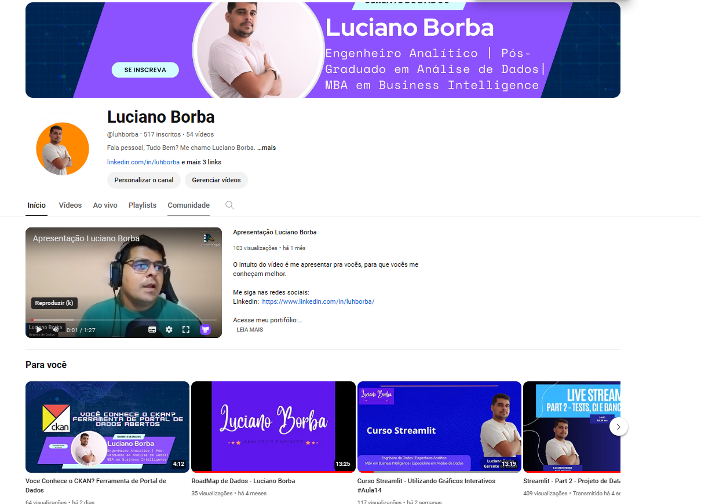

# Youtube

Possuo um canal no Youtube onde compartilho vídeos com minhas experiências e aprendizados dentro da área de dados, ontem tenho bastante vídeos sobre Streamlit.

## Playlists do Canal

### Curso de Streamlit

[Curso de Streamlit](https://www.youtube.com/playlist?list=PL8rfA4a53x0Q3rnBuWkvYIQvGTj_iZHpb)

### Desafio Data Glow UP nº 30

[Desafio DataGlowUP - Nº 30](https://www.youtube.com/playlist?list=PL8rfA4a53x0Q1FYbZr1VmduivvQceEvnl)

### Projeto Câmara dos Deputados 2023

[Dados Câmara dos Deputados 2023](https://www.youtube.com/playlist?list=PL8rfA4a53x0RuhfvfZcW5KtOSOEE0HKUA)